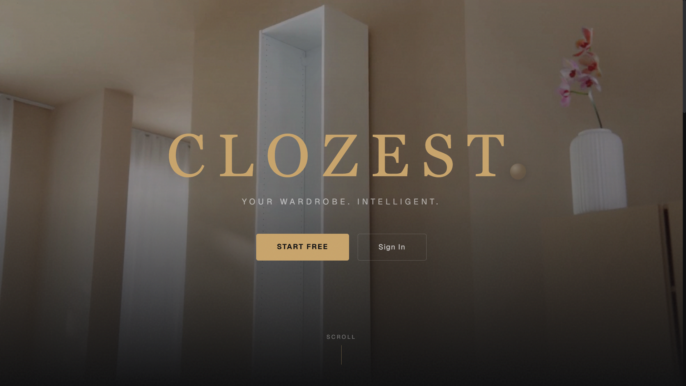
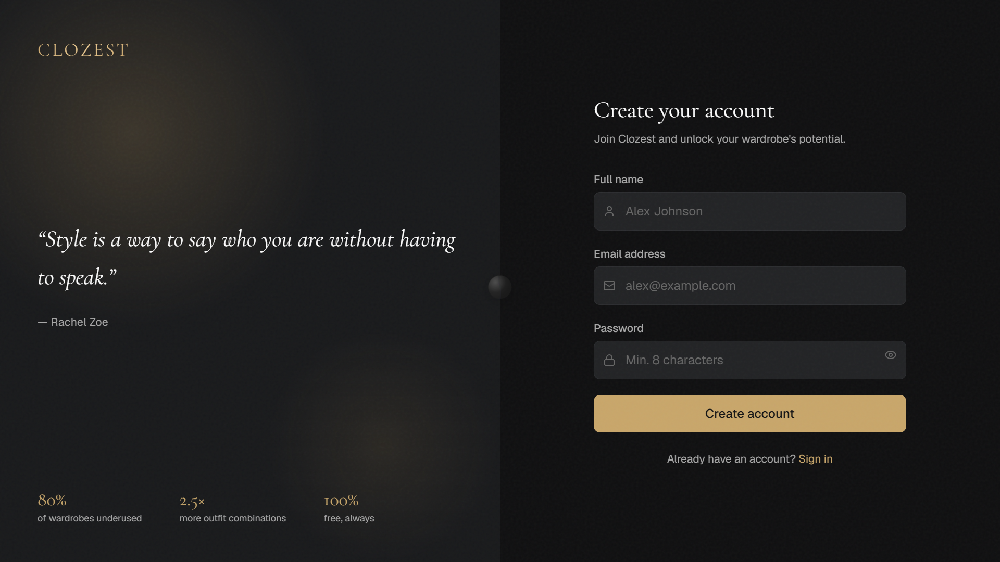
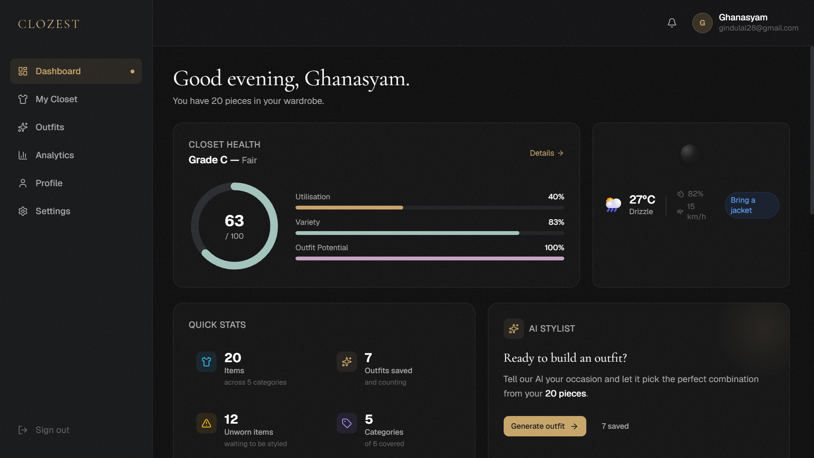
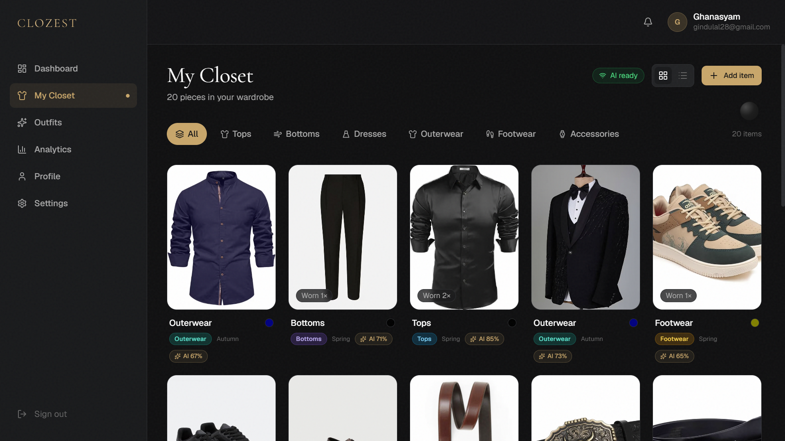
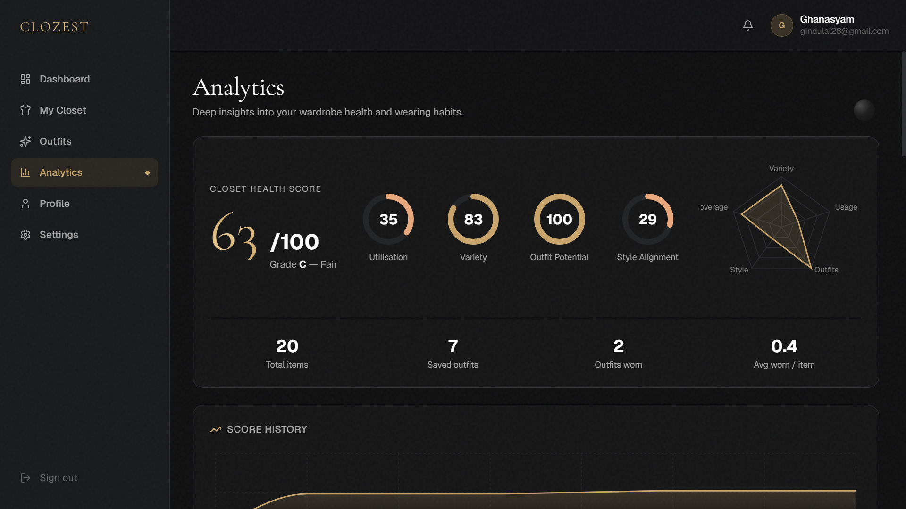

# Clozest — AI-Powered Digital Wardrobe

> Your wardrobe, maximised.

[](https://nextjs.org)
[](https://www.typescriptlang.org)
[](https://opensource.org/licenses/MIT)

Clozest helps users maximise the value of clothes they already own before recommending purchases. It transforms a user's wardrobe into a smart, AI-driven styling ecosystem — **no paid APIs, completely free to deploy.**

---

## Stack

| Layer      | Technology                                 |
| ---------- | ------------------------------------------ |
| Frontend   | Next.js 15, React 19, TypeScript, Tailwind |
| Auth       | Auth.js v5 (Credentials + JWT)             |
| Database   | Supabase PostgreSQL + Prisma ORM           |
| Storage    | Supabase Storage                           |
| AI Service | FastAPI + CLIP (HuggingFace) on Render     |
| Weather    | Open-Meteo API                             |
| Deployment | Vercel (web) + Render (AI)                 |
| Monitoring | Sentry (error tracking, 5K events/mo free) |

---

## Screenshots

<p align="center">
  
  
</p>

<p align="center">
  
  
</p>

<p align="center">
  
</p>

## Quick Start

### Prerequisites

- Node.js 20+
- Python 3.11+
- [Supabase](https://supabase.com) account
- [Render](https://render.com) account
- [Vercel](https://vercel.com) account

### 1. Clone and install

```bash
git clone https://github.com/your-org/clozest.git
cd clozest
npm install
```

### 2. Configure environment

```bash
cp .env.local.example .env.local
```

Fill in all values. See [Environment Variables](#environment-variables) below.

### 3. Database setup

```bash
# Push Prisma schema to Supabase
npx prisma db push

# Verify in Prisma Studio
npx prisma studio
```

### 4. Supabase Storage

Run `supabase-setup.sql` in the Supabase SQL Editor:

- Creates `wardrobe-items`, `avatars`, `outfit-assets` buckets
- Sets RLS policies so users can only access their own files

### 5. Run locally

```bash
# Next.js app
npm run dev
# → http://localhost:3000

# FastAPI AI service (optional — mock mode works without it)
cd ai-service
python -m venv .venv
source .venv/bin/activate   # Windows: .venv\Scripts\activate
pip install -r requirements.txt
uvicorn main:app --reload --port 8000
# → http://localhost:8000/docs
```

---

## Deployment

### Vercel (Next.js)

```bash
# Install Vercel CLI
npm i -g vercel

# Deploy
vercel --prod
```

Add all environment variables in the Vercel dashboard under **Settings → Environment Variables**.

The build command (`prisma generate && next build`) is set in `vercel.json`.

### Render (AI Service)

1. Create a new **Web Service** in [Render](https://render.com)
2. Connect your GitHub repo, set root directory to `ai-service/`
3. Build command: `pip install -r requirements.txt`
4. Start command: `uvicorn main:app --host 0.0.0.0 --port $PORT`
5. Set env vars: `AI_SERVICE_SECRET`, `ALLOWED_ORIGINS`

First deploy downloads CLIP models (~300MB) — allow 5–10 minutes.

### Sentry (Error Monitoring)

1. Create a project at [sentry.io](https://sentry.io)
2. Add `NEXT_PUBLIC_SENTRY_DSN`, `SENTRY_ORG`, `SENTRY_PROJECT`, `SENTRY_AUTH_TOKEN` to env

---

## Environment Variables

| Variable                                | Description                                       |
| --------------------------------------- | ------------------------------------------------- |
| `DATABASE_URL`                          | Supabase PostgreSQL URI with `?pgbouncer=true`    |
| `DIRECT_URL`                            | Direct PostgreSQL URI (for migrations)            |
| `AUTH_SECRET`                           | Random 32-byte secret (`openssl rand -base64 32`) |
| `NEXTAUTH_URL`                          | Your deployment URL                               |
| `NEXT_PUBLIC_SUPABASE_URL`              | Supabase project URL                              |
| `NEXT_PUBLIC_SUPABASE_ANON_KEY`         | Supabase anon key                                 |
| `SUPABASE_SERVICE_ROLE_KEY`             | Supabase service role key (server-only)           |
| `AI_SERVICE_URL`                        | Render FastAPI URL                                |
| `AI_SERVICE_SECRET`                     | Shared secret between Next.js and FastAPI         |
| `NEXT_PUBLIC_AI_CLASSIFICATION_ENABLED` | `"true"` to enable AI, `"false"` for mock mode    |
| `NEXT_PUBLIC_SENTRY_DSN`                | Sentry DSN                                        |
| `SENTRY_AUTH_TOKEN`                     | Sentry auth token for source map upload           |
| `CRON_SECRET`                           | Secret for Vercel Cron job auth                   |

---

## Testing

### Unit tests

```bash
npm test                  # run once
npm run test:watch        # watch mode
npm run test:coverage     # with coverage report
```

Covers: Zod schemas, utility functions, analytics calculations, rate limiter, file validation.

### E2E tests (Playwright)

```bash
# Start the dev server first
npm run dev

# In another terminal:
npm run test:e2e          # headless
npm run test:e2e:ui       # interactive UI mode
npm run test:e2e:headed   # visible browser
```

E2E coverage: landing page, auth flows, dashboard, closet, outfit generator, analytics, profile, settings, accessibility checks.

---

## Architecture

```
clozest/
├── src/
│   ├── app/              # Next.js App Router — pages + API routes
│   │   ├── (app)/        # Authenticated app shell
│   │   ├── (auth)/       # Login / Register
│   │   ├── (onboarding)/ # 3-step onboarding
│   │   └── api/          # REST API endpoints
│   ├── features/         # Feature-based modules
│   │   ├── auth/
│   │   ├── closet/       # Digital wardrobe
│   │   ├── outfits/      # Outfit generation + management
│   │   ├── dashboard/
│   │   ├── analytics/    # Health score + charts
│   │   ├── onboarding/
│   │   ├── profile/
│   │   └── settings/
│   ├── components/       # Shared UI primitives
│   ├── services/         # External service clients
│   ├── actions/          # Next.js Server Actions
│   ├── schemas/          # Zod validation
│   ├── hooks/            # Custom React hooks
│   ├── types/            # TypeScript interfaces
│   ├── lib/              # Core singletons (Prisma, Auth, Supabase)
│   ├── utils/            # Pure utility functions
│   └── tests/
│       ├── unit/         # Vitest unit tests
│       └── e2e/          # Playwright E2E tests
├── ai-service/           # FastAPI AI microservice
│   ├── main.py
│   ├── routers/          # classify.py + generate_outfit.py
│   ├── models/           # CLIP loader
│   └── requirements.txt
├── prisma/               # Database schema
└── public/               # Static assets
```

---

## Implementation Phases

| Phase | Feature                         | Status      |
| ----- | ------------------------------- | ----------- |
| 1     | Foundation, Auth, Design System | ✅ Complete |
| 2     | Digital Closet, Upload Flow     | ✅ Complete |
| 3     | Style DNA, Onboarding           | ✅ Complete |
| 4     | AI Classification               | ✅ Complete |
| 5     | Outfit Recommendation Engine    | ✅ Complete |
| 6     | Analytics & Health Score        | ✅ Complete |
| 7     | Production Readiness            | ✅ Complete |

---

## Design System

| Token         | Value              | Usage                 |
| ------------- | ------------------ | --------------------- |
| Background    | `#0F0F10`          | Page background       |
| Surface       | `#17181B`          | Card/panel background |
| Accent (Gold) | `#C8A46B`          | CTAs, highlights      |
| Foreground    | `#FFFFFF`          | Primary text          |
| Muted         | `#A7A7A7`          | Secondary text        |
| Primary font  | Geist Sans         | UI text               |
| Display font  | Cormorant Garamond | Headlines, logo       |

---

## API Reference

| Method           | Endpoint                           | Auth | Description                  |
| ---------------- | ---------------------------------- | ---- | ---------------------------- |
| POST             | `/api/auth/register`               | ❌   | Create account               |
| GET/PATCH        | `/api/profile`                     | ✅   | User profile                 |
| POST             | `/api/profile/style`               | ✅   | Upsert style DNA             |
| POST             | `/api/profile/complete-onboarding` | ✅   | Mark onboarding done         |
| GET/POST         | `/api/wardrobe`                    | ✅   | List / create wardrobe items |
| GET/PATCH/DELETE | `/api/wardrobe/[id]`               | ✅   | Item detail                  |
| POST             | `/api/wardrobe/upload`             | ✅   | Upload image to Supabase     |
| GET/POST         | `/api/outfits`                     | ✅   | List / save outfits          |
| GET/DELETE       | `/api/outfits/[id]`                | ✅   | Outfit detail                |
| POST             | `/api/outfits/[id]/wear`           | ✅   | Mark outfit as worn          |
| GET              | `/api/analytics`                   | ✅   | Full analytics payload       |
| POST             | `/api/ai/classify`                 | ✅   | AI clothing classification   |
| POST             | `/api/ai/generate-outfit`          | ✅   | AI outfit generation         |
| POST             | `/api/ai/bulk-classify`            | ✅   | Batch classification         |
| GET              | `/api/ai/warmup`                   | ❌   | Ping AI service              |
| GET              | `/api/cron/health-snapshot`        | 🔑   | Daily health score snapshot  |

---

## Contributing

1. Fork the repository
2. Create a feature branch: `git checkout -b feature/your-feature`
3. Commit: `git commit -m "feat: add your feature"`
4. Push: `git push origin feature/your-feature`
5. Open a Pull Request

---

## License

MIT — see [LICENSE](LICENSE) for details.
